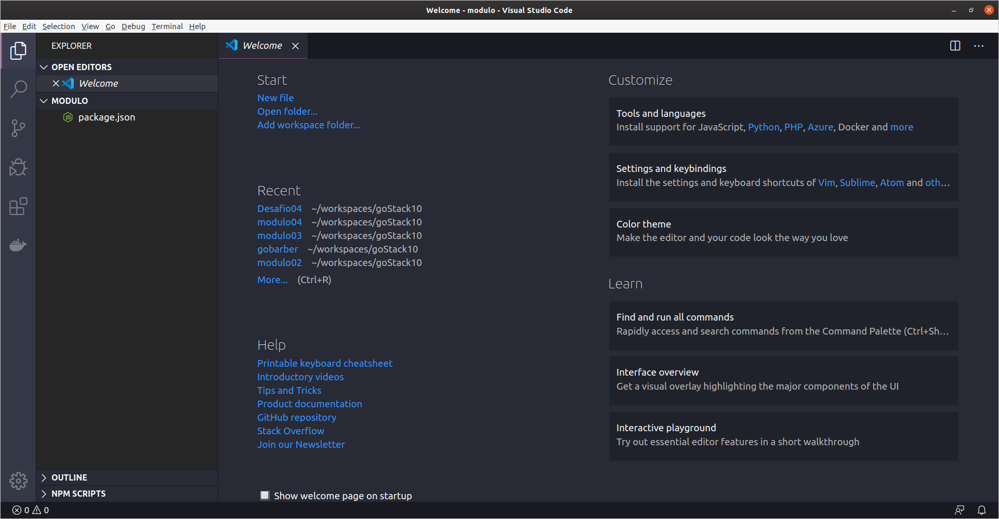
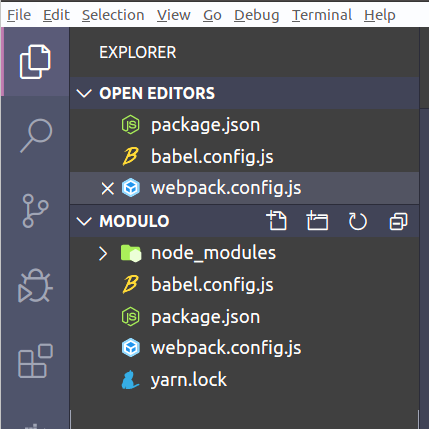
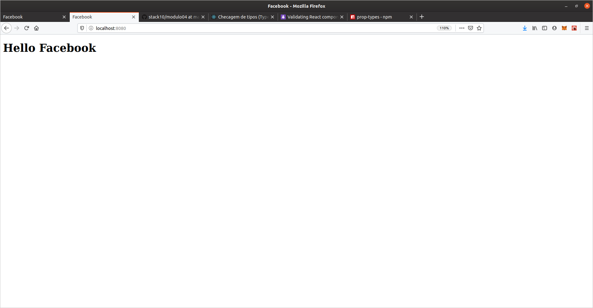

## Configuração Workspace

> Foi utilizado o [Yarn](https://yarnpkg.com/getting-started). Utilize o site para maiores informações.

#### Passos

#### 1º:
> Dentro do seu workspace crie o diretorio para seu projeto.
> ```sh
> $ mkdir <PROJETO-NAME> 
> ```
> Utilizei o nome desafio04 uma vez que estou no curso do [RocketSeat](https://github.com/Rocketseat/bootcamp-gostack-desafio-04/blob/master/README.md#desafio-04-introdu%C3%A7%C3%A3o-ao-react) e este desafio esta na ordem 04 e é um desafio.
>
> No terminal:
> ```sh
> $ cd <PROJETO-NAME>
> $ yarn init
>$ question name (testdir): PROJETO-NAME
>$ question version (1.0.0): VERSÂO
>$ question description: Descricao-PROJETO
>$ question entry point (index.js):
>$ question git repository: URL DO GIT DO PROJETO
>$ question author: SEU NOME
>$ question license (MIT):
>$ question private:
> $ success Saved package.json
> $ Done in 87.70s.
>```

#### 2º
>Abra seu [vsCode](https://code.visualstudio.com/). Utilizo o vscode por preferência, porém vc deve utilizar o de sua preferência.
>
> No terminal:
>```sh
> $ code .
> ```
> O vsCode irá abrir dentro do diretorio que foi yarn foi inicializado.
> Conforme Figura abaixo:
> 
> Agora abra o terminal dentro do vsCode.

##### Realizando configurações iniciais
#### 3º

> Vamos instalar como dependencia de desenvolvimento as seguintes bibliotecas:
 - @babel/core
 - @babel/preset-env
 - @babel/preset-react
 - babel-loader
 - webpack
 - webpack-cli
 - webpack-dev-server

> No terminal:
>```sh
> $ yarn add @babel/core @babel/preset-env @babel/preset-react babel-loader -D
> Done in 3.57s.
> $ yarn add webpack webpack-cli webpack-dev-server -D
> Done in 7.71s.
> ```

>Agora vamos instalar como dependência as bibliotecas do **react** e **react-dom**:
> No terminal:
>```sh
> $ yarn add react react-dom
> Done in 2.71s.
> ```

#### 4º

##### Vamos configurar o webpack e babel
>Crie os arquivos **babel.config.js** e **webpack.config.js**. 



> Abra o **babel.config.js**
> _Vamos utilizar o que foi instalado. O preset-env e preset-react são responsáveis por alterar nosso código no momento da compilação deixando ele compatível com a versão anterior do ECMASCRIPT._
> 
> Vamos escrever no babel.config.js: 
>  ```JavaScript
> module.exports={
>    presets:[
>       '@babel/preset-env',
>        '@babel/preset-react'
>   ],    
>}
>```
>
> Precisamos neste momento criar um diretorio chamado **src** está pasta é responśavel por armazenar todo código javaScript do nosso projeto.
> Vamos criar o arquivo **index.js** que será o arquivo de entrada para a nossa aplicação.
>
>   Abra o **webpack.config.js**:
>  ```JavaScript
> module.exports={
>const path = require('path');
>
>module.exports={
>    entry: path.resolve(__dirname, 'src', 'index.js'), //Entrada da nossa aplicação
>    output:{
>        path: path.resolve(__dirname, 'public'),
>        filename: 'bundle.js' //Onde será jogado nosso arquivo compilado
>    },
>  devServer:{
>        contentBase:path.resolve(__dirname,'public'),
>    },
>   module:{ // Addcionamos as regras para transpilação 
>       rules:[
>               {
>                   test: /\.js$/,
>                   exclude: /node_modules/,
>                   use:{
>                          loader: 'babel-loader
>                       } 
>               },
>               {
>                //css, imagem, ...
>               },
>           ]
>   }  
>}
>```

#### 5º
##### Configurar package.json _"Scripts"_

> Dentro do arquivo package.json vamos adicionar a configuração que vai possibilitar realizar a compilação do nosso projeto.
> Agora devemos adicionar a seguinte instrução:
> ```JSON
> "scripts": {
>    "build": "webpack --mode production",
>    "dev": "webpack-dev-server --mode development" //iremos utilizar para rodar nosso projeto em desenvolvimento.
>  },
>```

#### 6º
##### Criar o Index.html

> Antes de mais nada precisamos criar o diretório public que será responsável por armazenar nosso códgio compilado, através do arquivo **bundle.js** (*Configuramos no webpack.config.js* anteriormente).
> Dentro da pasta public vamos criar o arquivo ***index.html***.
> ```html
>  <div id='App'></div> <!--Dentro do body adicionamos a div e o script-->
>  <script src="bundle.js"></script>
>```

#### 7º
##### Crei o arquivo App.js

> Dentro da pasta **src** crie o arquivo app.js
> dentro do arquivo inclua o seguinte código:
> ```JavaScript
> import React from 'react';
>
>function App(){
>    return <h1>Hello Facebook</h1>
>}
>export default App;
>```
> E dentro do arquivo index.js adicione o seguinte código:
> ```JavaScript
>import React from 'react';
>import {render} from 'react-dom';
>
>import App from './App';
>
>render(<App/>, document.getElementById('App'));
>```

> No terminal do vscode execute o comando
> ```sh
> $ yarn dev
> ```
> Aguarde o webpack e babel compilar e o servidor subir.
> Após a messagem: *ℹ ｢wdm｣: Compiled successfully.* 
> abra o browser e digite [localhost:8080]()
>Pronto você visualizará conforme a imagem abaixo: 

__________________
- [Voltar](../Readme.md)
__________________
