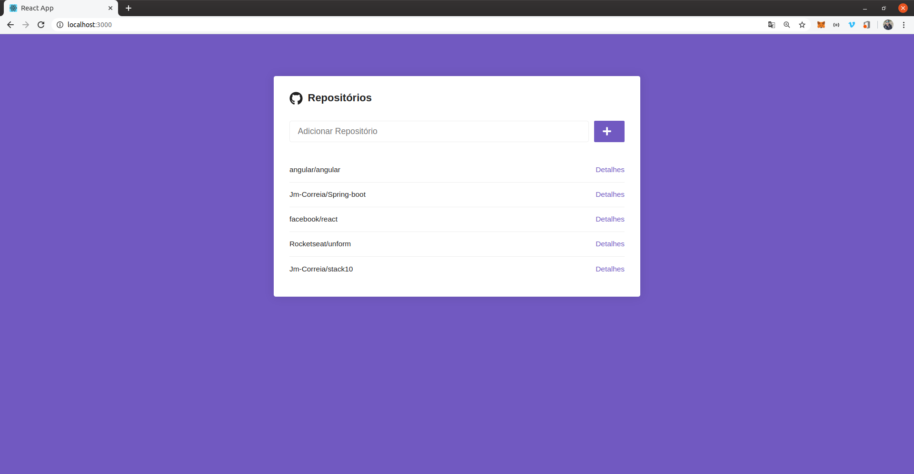
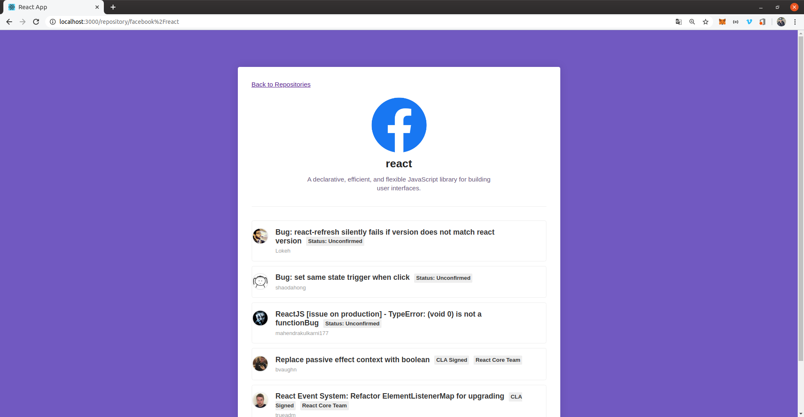

# :warning: gitReact :warning:

## *gitReact*:

> Este projeto visa cadastrar repositorios do github locamente usando localstorage do seu navegador e detalhar as principais issues abertas.


> Este projeto faz parte das aulas do bootCamp da *[Rocketseat - GoStack](https://rocketseat.com.br/gostack)*.


# Tecnologias

### Ferramentas:
> - [Nodejs - **v-10.13.0**](https://nodejs.org/en/)
> - [Yarn - **v-1.21.1**](https://yarnpkg.com/)
> - [VsCode](https://code.visualstudio.com/)

### Principais Bibliotecas:
| Nome| Versão|
| -----| ------|
|react | 16.13.0|
|react-dom | 16.13.0|
|react-icons | 3.9.0|
|react-router-dom" | 5.1.2|
|styled-components | 5.0.1|

# Executar Projeto:

> Clone o projeto para sua maquina executando o comando:
> ```Git
>  git clone https://github.com/Jm-Correia/stack10.git
> ```
> Dentro do diretorio que foi clonado executar:
> ```sh
> $ cd modulo05/
>```
> Execute o comando:
> ```sh
> $ code .
> ```

## ENV

> criar o arquivo .env e adicionar SKIP_PREFLIGHT_CHECK=true

#### Abrir o terminal do vscode:

> Instalar bibliotecas:
> ```sh
> $ yarn
> ```
> Inciar Projeto:
> ```sh
> $ yarn start
> ```
> - Pronto, Aplicação rodando!!!

## Acessar a URL http://localhost:3000

> 
> Exemplo para cadastrar um repositorio:
> **facebook/react**

> 
> É apresentado informações do repositório e algumas issues abertas. Atualmente é mostrado 5 issues com status aberto.

# Licença:

### [MIT](https://opensource.org/licenses/MIT)
