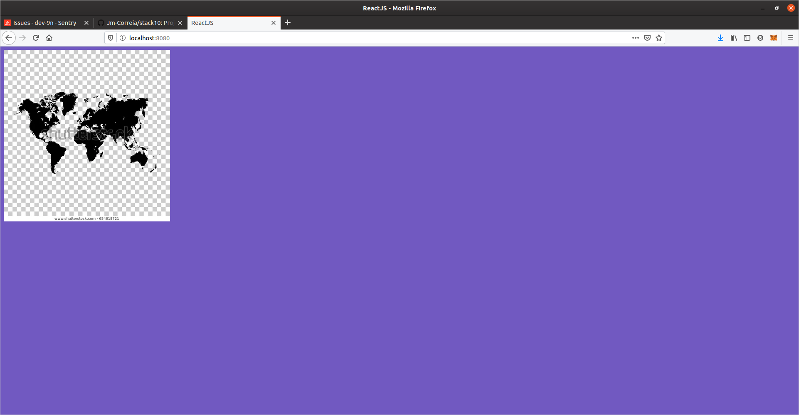

# Exemplo de workspace
> Este projeto é um exemplo de configuração inicial 
> para desenvolvimento usando reactJS
>
> Foi utilizado o [yarn](https://yarnpkg.com/getting-started) junto com o nodejs
> para a montagem deste ambiente.

# Após clonar o projeto
> Abra o terminal e vá até a pasta deste projeto
>
>No ubuntu (exemplo):
> ```sh
> $ cd ${PASTA_DO_CLONE}/modulo03
> ```
>
>Executar os seguintes comandos no terminal:
>
> ```sh
> $ yarn
> $ yarn dev
> ```
> Após executar aguarde a mensagem no terminal:
> ```sh
> ℹ ｢wdm｣: Compiled successfully.
> ```
> Abra seu browser Preferido e coloque 
> 
>  - url: http://localhost:8080
>
> Será exebido:
> 

